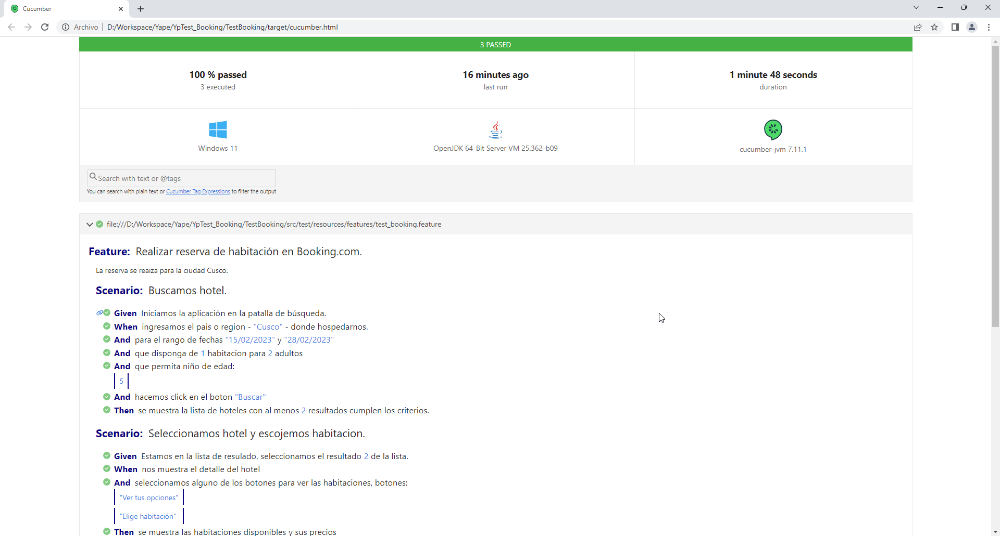

# **YP! TEST BOOKING MOBILE APP**

# DESAFÍO

###### Actividades a desarrollar

1. Proponga usted el plan de pruebas a desarrollar para realizar la automatización de pruebas según
   las funcionalidades indicadas en el **Anexo 1**.
2. Implemente el código necesario para la creación del script de pruebas automatizadas según la
   funcionalidad indicada en el **Anexo 1** e indique la cobertura de pruebas obtenida por el script.
3. Indique las herramientas y técnicas utilizadas para realizar la automatización de la funcionalidad
   descrita en el **Anexo 1**.

###### Consideraciones:

* Automatizar las funcionalidades del flujo completo de la reserva en la aplicación móvil.
* Considerar la creación de escenarios Happy Paths y UnHappy Paths.
* Considerar en la automatización todas las aserciones posibles.

###### Anexo 1

Aplicación móvil de Booking.com ([Archivo APK](https://drive.google.com/file/d/1ruY_5qcqWlsE3-W3rgXpFyyMiO59wFUc/view?usp=sharing)).

# SOLUCIÓN

> ***Nota**: Se sugiere visualizar los archivos **.md** directamente en el repositorio Github o usar un editor local si se descarga el proyecto.*

###### 1. Plan de Pruebas

- El archivo ***[Plan de Pruebas](./TEST_PLAN.md)*** es:[TEST_PLAN.md](./TEST_PLAN.md).
- El archivo ***[Casos de Pruebas](./TestBooking/src/test/resources/features/test_booking.feature)*** basado en Cucumber está en: `TestBooking\src\test\resources\features\test_booking.feature`

###### 2. Código y cobertura

- Proyecto Java/Cucumber/Appium para automatización: `TestBooking\`
- La cobertura de las pruebas es:
  - Realizar la búsqueda de hoteles.
  - Escoger el hotel y la habitacion.
  - Reservar la habitacion.
  - Escenarios de pruebas establecidos en el ***[Plan de Pruebas](./TEST_PLAN.md) sección 7.***

###### 3. Herramientas y técnicas

- Para las herramientas utilizadas ver el ***[Plan de Pruebas](./TEST_PLAN.md) sección 4***.
- Para las técnicas utilizadas ver el ***[Plan de Pruebas](./TEST_PLAN.md) sección 6***.

**DEMO**

**REPORTE** (`HTML File --> <ProjectPath>/target`)

END
